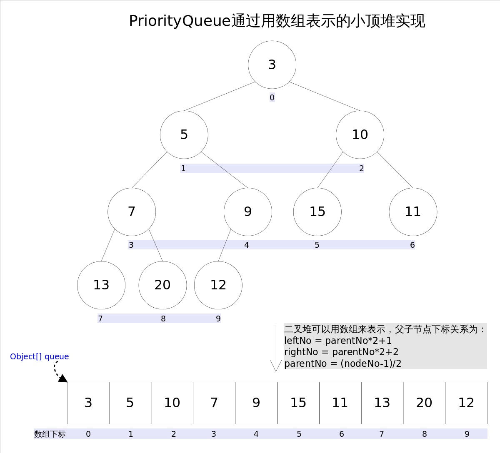

# 大顶堆 和 小顶堆


先来了解下 `堆` 结构； 堆也被称为`优先队列`，`二叉堆` ； 

特点

* 堆总是一颗完全二叉树树， 使用数组作为其存储结构，因此也叫 `二叉堆`； 用链表存的就叫二叉树了
* 任一节点小于（或大于）其所有的孩子节点； 
* 堆分小根堆和大根堆； 如果根节点大于所有孩子节点，这就是一颗大根堆，也就是根节点是堆上的最大值；如果节点小于所有的子节点，这就是一颗小跟堆，也即是根节点是堆上所有节点的最小值。
* 小根堆： 每次取出来的元素都是队列中值最小的


`堆用数组来存储`，因为是一颗完全二叉树，i节点的父节点索引就是(i-1)/2, 左右子节点小标是 2i+1，2i+2。


比如小根堆存储示例




### 应用场景

* 优先队列  如iOS中的 NSOperationQueue 就是维护一个优先队列  
* 堆排序  
* [top-K 大(小)](Top-K%20问题.md) , top-k大 问题就是用 小根堆， 小根堆 固定为 k 个元素大小 ， 遍历 k-N (N为所有数据的个数)，插入小根堆并调整堆，以保证堆内的k个元素，总是当前最大的k个元素。


### Java PriorityQueue 


Java PriorityQueue 类就是 通过二叉小顶堆实现 ，也叫优先级队列实现。  有如下特点：

* 实现 Queue 接口
* 头部是基于自然排序或基于比较器的排序的最小元素
* 不是线程安全的，PriorityBlockingQueue在并发环境中使用


API 如下：

* boolean add（object）：将指定的元素插入此优先级队列。
* boolean offer（object）：将指定的元素插入此优先级队列。
* boolean remove（object）：从此队列中删除指定元素的单个实例（如果存在）。
* Object poll（）：检索并删除此队列的*头部*，如果此队列为空，则返回null。
* Object element（）：检索但不删除此队列的*头部*，如果此队列为空，则返回null。
* Object peek（）：检索但不删除此队列的*头部*，如果此队列为空，则返回null。
* void clear（）：从此优先级队列中删除所有元素。


```
{
            PriorityQueue<Employee> pq = new PriorityQueue();
            pq.add(new Employee(1L, "AAA", LocalDate.now()));
            pq.add(new Employee(4L, "BBB", LocalDate.now()));
            pq.add(new Employee(3L, "DDD", LocalDate.now()));
            pq.add(new Employee(7L, "GGG", LocalDate.now()));
            pq.add(new Employee(2L, "CCC", LocalDate.now()));

            while (true) {
                Employee head = pq.poll();
                System.out.println(head);
                if (head == null) {
                    return;
                }
            }
        }

```

输出

```
Employee [id=1, name=AAA, dob=2021-12-22]
Employee [id=2, name=CCC, dob=2021-12-22]
Employee [id=3, name=DDD, dob=2021-12-22]
Employee [id=4, name=BBB, dob=2021-12-22]
Employee [id=7, name=GGG, dob=2021-12-22]
```


如下，使用 PriorityQueue实现的 top-K 大问题，实现如下：

```Java 
/** 
     *  小根堆实现
     */
    public static int findMaxK(int[] nums, int k) {
        PriorityQueue<Integer> pq = new PriorityQueue<>(k, (a, b) -> (a-b) );

        for (int i = 0; i <nums.length ; i++) {
            //取出前k个元素放入 PQ 中
            if (i < k) {
                pq.add(nums[i]);
                continue;
            }

            Integer head = pq.peek();
            if (head < nums[i]) {//维护 priorityQueue 中元素只有k个
                pq.poll();
                pq.add(nums[i]);
            }
        }
        return pq.poll();
    }
```


# 堆存储结构


堆的操作有：

* 建堆  
* 插入：都是插入到数组最后，然后再调整满足堆次序  
* 删除：删除总是发生在 A[0]处，也就是只删除根节点 


这样难怪`堆`被称为 `优先队列`。 插入和删除分别在 数组尾部和头部，只是需要再次调整以满足堆次序。


### 堆调整

插入或删除元素以后， 如何进行堆调整， 已满足堆次序？


优先级队列的代码实现


```java
public class MaxPQ
    <Key extends Comparable<Key>> {
    // 存储元素的数组
    private Key[] pq;
    // 当前 Priority Queue 中的元素个数
    private int N = 0;

    public MaxPQ(int cap) {
        // 索引 0 不用，所以多分配一个空间
        pq = (Key[]) new Comparable[cap + 1];
    }

    /* 返回当前队列中最大元素 */
    public Key max() {
        return pq[1];
    }

    /* 插入元素 e */
    public void insert(Key e) {...}

    /* 删除并返回当前队列中最大元素 */
    public Key delMax() {...}

    /* 上浮第 k 个元素，以维护最大堆性质 */
    private void swim(int k) {...}

    /* 下沉第 k 个元素，以维护最大堆性质 */
    private void sink(int k) {...}

    /* 交换数组的两个元素 */
    private void exch(int i, int j) {
        Key temp = pq[i];
        pq[i] = pq[j];
        pq[j] = temp;
    }

    /* pq[i] 是否比 pq[j] 小？ */
    private boolean less(int i, int j) {
        return pq[i].compareTo(pq[j]) < 0;
    }

    /* 还有 left, right, parent 三个方法 */
}

```


