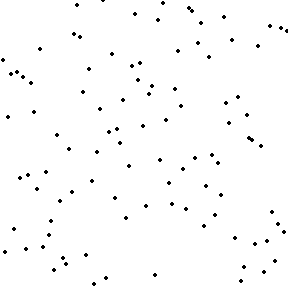

## 排序算法

**排序的稳定性** 是指对于相等的元素，排序之后，任然保存2个元素的位置没有变，就是稳定的排序，反之就是不稳定排序。


**交换排序算法**

* 冒泡排序
* 插入排序    
* 选择排序    
* 希尔排序
* 快排   
* 归并排序  
* 堆排序

**线性排序算法**
    
* 桶排序 


## 交换排序算法

排序算法的复杂度由 `比较的次数` 和 `交换的次数` 一起决定。


### 直接选择排序

1. 从未排序的序列中选择最小的元素，与放在第一个位置的元素交换
2. 依次类推，直到全部排序

在a【i,n】中最小的元素和 a[i]交换位置。空间复杂度O(1)，时间复杂度 O(n^2)


### 冒泡排序

1. 相邻的2各元素比较，大的向后移，经过一轮比较，做大的元素排在最后
2. 第二轮，第二大的元素排倒数第二个位置
3. 直到全部排好

这样，即使是排好序的拿冒泡排序排序，比较的时间复杂度O(n^2)


### 插入排序

1. 第一个元素算作已经排好
2. 取下一个元素，从已经排好的序列元素中，从后向前扫描
3. 如果排好序的元素大于 新元素，排好序的元素移到下一个位置
4. 重复3，直到直到最后的插入位置
5. 重复2

类似插入扑克牌的效果

最坏的情况： 待排序的是一个逆序排放的数组，这样导致每一轮都要移动元素；此时复杂度是是0(n^2) 
最好的情况： 待排序的是一已经顺序排放的数字，此时只需要做一轮比较就够了 0（n）。因此可以看到，**对大部分数据已经有序这样的数组排序，使用`插入排序`非常有优势**

空间复杂度O（1）


### 希尔排序

递减增量排序算法，对`插入排序`的改进，实质是分组插入排序，又叫`缩小增量排序`

1. 先将待排数列分割成若干子序列（增量为m)
2. 对每个子序列使用`插入排序`
3. 减小增量，再排序
4. 对全体元素做一次`插入排序`

`希尔排序`提升排序的奥秘就在于`数据元素越有序，使用插入排序效率越高`


### 快速排序


递归一次，pivot 左边都比它小，右边都比它大。这是递归，分治的思想。

对 A[p...r] :  
1. 分解：A[p..q-1]  A[q+1..r],使得 A[p...q-1]<A[q]<A[q+1..r]  
2. 解决：递归调用 快排，，对子数组A[p..q-1],A[q+1..r]排序  
3. 合并（子问题相互独立的，因此用分治算法就可以了）  
  
具体步骤：

1. 从数列中选择一个元素，作为基准 pivot。通常取分区的第一个或最后一个
2. 重排数列，比 pivot 小得排左边，比pivot大的排右边，相等的随便。 一句话就是`挖坑填数`
3. 递归的，使用相同的方式，重排左右两边的子序列

扫描过程分2种：  
1. 挖坑排序，2头向中间扫描，先从后向前找，再从前向后找。  
2. 单向扫描  

```
    void quicksort(int *a, int left, int right){
        if (left<right)//加上这个，不然有死循环，造成堆栈溢出，这也是递归结束条件
        {
            int i = partion(a,left,right);//使得局部有序，i作为分隔
            quicksort(a,left,i-1); 
            quicksort(a,i+1,right);
        }
    }

    // 挖坑填数，2边向中间扫描
    int partion(int *a, int start,int end){
        int i=start,j=end;
        int tmp = a[i]; // 这里要做越界检查
        while(i<j){
            // 从后向前扫描，找到第一个小于tmp的值，来填a[i]
             while(i<j && a[j]>=tmp){
                 j--;
            }   
             if (i<j)//找到了,这时候a[j]为坑 
            {   
                a[i++] = a[j];  
            }
            // 从左向右扫描，找一个大于 tmp的 数， 去填坑a[j]
            while(i<j && a[i]<tmp){
                i++;
            }
            if (i<j)
            {
                a[j++]=a[i];
            }
        }
        //扫描完成后，i==j
        a[i]=tmp;
        return i;
    }

```


平均复杂度 O(n*logn)  
最坏O(n^2)  
空间复杂度  

快速排序是对冒泡排序的改进，划分交换排序。  


### 归并排序merge

分治算法，必然用到递归

2个有序数组的合并操作是O(n)的复杂度
因此我们可以将无序的数组，分成2个子数组分别排序，然后再merge,依次类推

归并排序的步骤: 

1. 分解。将一个数组分成n/2个子数组,每个序列2个元素，(2路归并)   
2. 解决。 将各个子数组都排好序，然后 merge 2个有序数组   
3. 合并   

    if (length>1)
    {    
        merge_sort(a,length/2);
        merge_sort(a+length/2,length-length/2);
        merge_array(a,length/2,a+length/2,length-length/2);
    }


### 堆排序

利用堆这种数据结构设计的一种排序算法

先来了解下 `堆` 结构

堆分小根堆和大根堆

堆： 任一节点小于（或大于）其所有的孩子节点，如果是大于所有孩子节点，这就是一颗大根堆，也就是根节点是堆上的最大值；如果节点小于所有的子节点，这就是一颗小跟堆，也即是根节点是堆上所有节点的最小值。

堆也被称为`优先队列`  
堆总是一颗完全树

`堆用数组来存储`，i节点的父节点就是(i-1)/2,左右子节点小标是 2i+1，2i+2。

堆的操作有：

建堆  
插入：都是插入到数组最后，然后再调整满足堆次序  
删除：删除总是发生在 A[0]处，也就是只删除根节点 

这样难怪`堆`被称为 `优先队列`。插入和删除分别在 数组尾部和头部，只是需要再次调整以满足堆次序。

`堆`的应用场景有：  
优先队列  如iOS中的NSOperationQueue 就是维护一个优先队列  
堆排序  


我们来看看如何使用`堆` 来做排序?    

1.将待排序数列看做一颗完全二叉树的存储结构   
2.`堆化数组`，结束后，根a[0]变成了最小的值（小根堆）  
3.取a[0]值，然后对`堆`做删除操作，此时，`堆`会重新 `堆化数组`，a[0]又是下一个最小的值。
删除操作通常是先把数组最后的元素提到a[0]位置，然后从根节点开始进行一次从上向下的调整；调整时，先从左右孩子中找最小的交换。如果父节点比每个节点都小就不用调整。（因此，在`堆排序`是可以直接让 a[0]和数组最后一个元素互换，但要先保存好a[0],或者a[n-1],这样导致了使用`堆排序`时，递增排序使用大根堆，递减排序使用小根堆。）     
4. 循环3，就可以按从小到大的顺序取出所有数组元素。  

堆排序主要时间花在建堆期间和`堆化数组`，找数列中最大树只需要O(1)时间复杂度  


    void heap_sort(int *a, int length){
        // 建立堆 大根堆，递增排序
        heap_build(a,length);
        for (int i = length-1; i >0; --i)
        {
         //交换
         heap_swop(&a[0],&a[i]);
            //调整
         heap_adjust(a,i);
        }
    }


推排序还可以用来求 top-K 大(小)的问题。


接下来，我们看一组排序的动画，你看看能不能猜到他们使用了什么排序算法完成。


    



答案是：

快排   |归并排序|堆排序   
选择排序|冒泡排序|希尔排序 


国外也有人通过舞蹈的方式编排了几种基本的排序算法，非常有趣。[点这里去看看](http://v.youku.com/v_show/id_XMzMyODk4NTQ4.html?from=s1.8-1-1.2)


## 线性排序算法

上面的算法都是基于比较的排序，时间复杂度最好也是 NlogN.而非基于比较的排序，可以突破NlogN的时间下限。当然，非比较的排序，也是需要有一些限定条件的。


### 桶排序  bucket sort

比如给全校学生做个分数排序，最大分100分。我们使用一个100个空间的辅助数据，以key为分数，value为命中的次数。通过O(n)复杂度就可以完成排序任务。这种排序方式就是桶排序。

也就是分配一个hash[100]的空间，初始化为0,遍历一遍，出现的数字就hash[k]++,这样再次遍历一次，就可以得到n个数的顺序了。


###小结

常见的排序算法都是比较排序，比较排序的时间复杂度通常为 O(n^2) 或 O(nlogn)  
但是如果带排序的数字有一些特俗性时，我们可以根据这来设计更加优化的排序算法。


