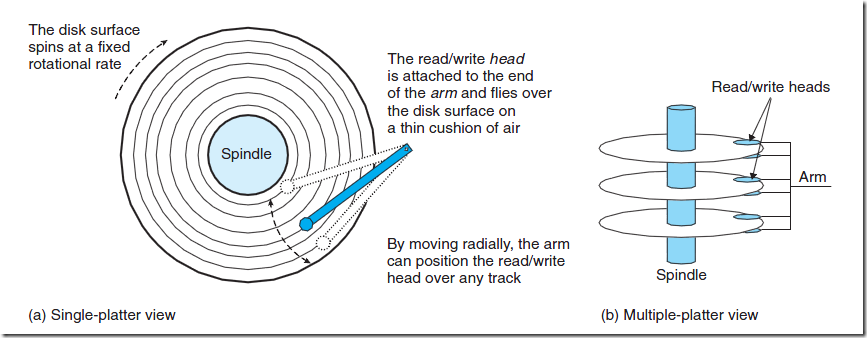

## 数据库索引

索引使用的数据结构多是B树或B+树。B树和B+树广泛应用于文件存储系统和数据库系统中，mysql使用的是B+树，oracle使用的是B树，Mysql也支持多种索引类型，如b-tree 索引，哈希索引，全文索引等。

一般来说，索引本身也很大，不可能全部存储在内存中，因此索引往往以索引文件的形式存储的磁盘上。索引查找过程中就要产生磁盘I/O消耗，相对于内存存取，I/O存取的消耗要高几个数量级，所以评价一个数据结构作为索引的优劣最重要的指标就是在查找过程中磁盘I/O操作次数的渐进复杂度。换句话说，索引的结构组织要尽量减少查找过程中磁盘I/O的存取次数。


### 磁盘数据查找过程



盘面：每一个盘片都有2个上下盘面，每个盘面都可以存储数据

柱面：所有盘面上的同一磁道构成一个圆柱，叫做柱面。磁盘读写按柱面进行;
只在同一柱面所有的磁头全部读/写完毕后磁头才转移到下一柱面，因为选取磁头只需通过电子切换即可，而选取柱面则必须通过机械切换。电子切换相当快，比在机械上磁头向邻近磁道移动快得多，所以，数据的读/写按柱面进行，而不按盘面进行。也就是说，一个磁道写满数据后，就在同一柱面的下一个盘面来写，一个柱面写满后，才移到下一个扇区开始写数据。读数据也按照这种方式进行，这样就提高了硬盘的读/写效率。

磁道：磁盘在格式化时被划分出许多同心圆，这些同心圆轨迹叫做磁道 track。磁道从外向内从0开始编号。

扇区：信息以脉冲串的形式记录在这些轨迹中，这些同心圆不是连续记录数据，而是被划分成一段段圆弧，每段圆弧叫做一个扇区，扇区从“1”开始编号 。扇区也叫块号。

磁盘在物理上划分为柱面, 磁道，扇区。想要读取扇区的数据，需要将磁头放到这个扇区上方:

1. 先找到柱面，也就是寻道。磁头是不能动的，但可以沿着磁盘半径方向运动，耗时记为寻道事件 t(seek)
2. 将目标扇区旋转到磁头下，这个过程耗时是旋转时间t(r)

一个磁盘扇区数据读取的时间t = t(seek)+t(r)+t(数据传输) , 在数据库查找数据时，查找时间与访问的磁盘盘块成正比，内存处理时间可以忽略不计。


### B树

2-3树：一个节点最多有2个key，红黑树就是2-3树的一种实现。

B树又叫多路平衡查找树。B树可以看做是对2-3树的扩展，允许每个节点有M-1个key，并以升序排列，这里的M就是B树的阶。


B树的度d(d>=2) ，有一些特征：

1. 根节点至少有2个子节点
2. 所有的叶节点具有相同的深度 h，也就是树高
3. 每个叶子节点至少包含一个key和2个指针，最多2d-1个key和2d个指针，叶节点的指针都是null。每个节点的关键字个数在【d-1,2d-1】之间
4. 每个非叶子节点，key和指针互相间隔，节点两端是指针，因此节点中指针个数=key的个数+1
5.  每个指针要么是null，要么指向另一个节点

如果某个指针在节点node最左边且不为null，则其指向节点的所有key小于v(key1)，其中v(key1)为node的第一个key的值。
如果某个指针在节点node最右边且不为null，则其指向节点的所有key大于v(keym)，其中v(keym)为node的最后一个key的值。
如果某个指针在节点node的左右相邻key分别是keyi和keyi+1且不为null，则其指向节点的所有key小于v(keyi+1)且大于v(keyi)。


使用数据结构表示如下：

```
typedef struct Item{
     int key;
     Data data;
}

#define m 3 //B树的阶

typedef struct BTNode{
    int degree; //B树的度
    int keynums; //每个节点key的个数
     Item  items[m];
     struct BTNode *p[m];
}BTNode,* BTree;

typedef struct{
     BTNode *pt; //指向找到的节点
     int i; // 节点中关键字的序号 (0,m-1)
     int tag; //1:查找成功，0：查找失败
}Result;

Status btree_insert(root,target);
Status btree_delete(root,target);
Result btree_find(root,target);

```

### 建立索引

当为一张空表创建索引时，数据库系统将为你分配一个索引页，该索引页在你插入数据前一直是空的。此页此时既是根结点，也是叶结点。每当你往表中插入一行数据，数据库系统即向此根结点中插入一行索引记录。

插入和删除新的数据记录都会破坏B-Tree的性质，因此在插入删除时，需要对树进行一个分裂、合并、转移等操作以保持B-Tree性质

### 查找操作

从root节点出发，对每个节点，找到等于target的key，则查找成功；或者找到大于target的最小k[i], 到 k[i] 左指针指向的子节点继续查找，直到页节点，如果找不到，说明关键字target不在B树中。

分析下时间复杂度：

对于一个度为d的B-Tree,每个节点的索引key个数是d-1, 索引key个数为N，树高h上限是：

2d^h-1=N ==> h=logd^((N+1) /2) ？？？

因此，检索一个key，查找节点的个数的复杂度是O(logd^N)

```
比如d=2，N=1,000,000 (1百万)，h差不多20个
d=3,N=1,000,000 (1百万) ,h差不多13个(3^11=1,594,323)
d=4,N=1,000,000 (1百万) ,h差不多10个
d=5,N=1,000,000 (1百万) ,h差不多9个 (5^9 = 1,953,125)
d=6,N=1,000,000 (1百万) ,h差不多8个(6^8 = 1,679,616)
d=7,N=1,000,000 (1百万) ,h差不多8个
d=8,N=1,000,000 (1百万) ,h差不多7个
d=9,N=1,000,000 (1百万) ,h差不多7个
d=10,N=1,000,000 (1百万) ,h差不多6个
d=100时，h差不多3个
```

数据库系统在设计时，通常将一个节点的大小设为一个页大小(通常4k)，这样保证一个节点在物理上也存储在一个页里，加上计算机存储分配都是按页对其，这样保证一个节点只需要一次I/O.

实际应用中，d都是比较大，通常超过100，因此1百万的数据通常最多访问3个节点，也就是3次I/O, 因此使用B树作为索引结构查询效率非常高。


### 插入数据

插入数据时，需要更新索引，索引中也要添加一条记录。索引中添加一条记录的过程是：

沿着搜索的路径从root一直到叶节点

每个节点的关键字个数在【d-1,2d-1】之间，当节点的关键字个数是2t-1时，再加入target就违反了B树定义，需要对该节点进行分裂：已中间节点为界，分成2个包含d-1个关键字的子节点（另外还有一个分界关键字，2*(d-1)+1=2d-1），同时把该分界关键字提升到该叶子的父节点中，如果这导致父节点关键字个数超过2d-1,就继续向上分裂，直到根节点。

如下演示动画，往度d=2的B树中插入：` 6 10 4 14 5 11 15 3 2 12 1 7 8 8 6 3 6 21 5 15 15 6 32 23 45 65 7 8 6 5 4`


### B树和B+树的区别

B树和B+树的区别在于：

1. B+树的非叶子节点只包含导航信息，不包含实际记录的信息，这可以保证一个固定大小节点可以放入更多个关键字，也就是更大的度d，从而树高h可以更小，从而相比B树有更优秀的查询效率
2. 所有的叶子节点和相邻的节点使用链表方式相连，便于区间查找和遍历


